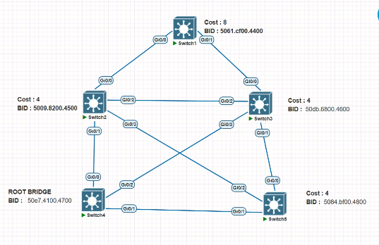

# Spanning Tree Protocol (STP) Lab

## Overview

This document explains the Spanning Tree Protocol (STP) configuration and port role selection process used in this lab topology with 5 switches (SW1–SW5).


---

## 1. Root Bridge Selection

STP selects the Root Bridge based on the **lowest Bridge ID (BID)**, which is a combination of priority and MAC address.

> **In this lab:** Root Bridge selection is done **manually** using the `primary` keyword. SW4 is configured as the Root Bridge.

**Configure SW4 as Root Bridge:**
```bash
SW4(config)# spanning-tree vlan 1 root primary
```

**Verify Root Bridge:**
```bash
SW4# show spanning-tree
```


---

## 2. Path Cost Calculation

Since all inter-switch links use **Gigabit Ethernet interfaces**, the STP cost per link is **4**.

STP calculates the cumulative cost from each switch to the Root Bridge:

| Switch | Cost to Root Bridge (SW4) |
|--------|--------------------------|
| SW1    | 8                        |
| SW2    | 4                        |
| SW3    | 4                        |
| SW4    | 0 *(Root Bridge)*        |
| SW5    | 4                        |

**Verify path cost on any switch:**
```bash
SW1# show spanning-tree detail
```

**Check interface cost:**
```bash
SW1# show spanning-tree interface gigabitEthernet 0/0 detail
```


---

## 3. Root Port (RP) Selection

Each non-root switch selects **one Root Port** — the port that provides the **lowest-cost path toward the Root Bridge**.

- The Root Port is always in a **Forwarding** state.
- Traffic flows **toward** the Root Bridge through this port.

**Selection criteria (in order):**
1. Lowest root path cost
2. Lowest sender Bridge ID
3. Lowest sender Port ID

**Verify Root Port on each switch:**
```bash
SW1# show spanning-tree
SW2# show spanning-tree
SW3# show spanning-tree
SW5# show spanning-tree
```


---

## 4. Designated Port (DP) Selection

A Designated Port is selected on **every network segment**. It forwards traffic **away from** the Root Bridge.

**Rules:**
- On each link, the switch with the **lowest cost to the Root Bridge** wins the Designated Port role.
- If costs are **equal**, the switch with the **lowest Bridge ID** wins.
- The Root Bridge holds the Designated Port on all of its directly connected segments.

> Every Root Port on a non-root switch has a corresponding Designated Port on the other end of the link.

**Verify Designated Ports:**
```bash
SW4# show spanning-tree detail
```

**Check a specific interface role:**
```bash
SW4# show spanning-tree interface gigabitEthernet 0/0
```


---

## 5. Blocked Port (BLK)

Any port that is **not elected** as a Root Port or Designated Port is placed in a **Blocking** state to prevent Layer 2 loops.

- Blocked ports do **not** forward traffic.
- They continue to receive BPDUs to stay aware of topology changes.

**Verify Blocked Ports:**
```bash
SW1# show spanning-tree
```

**Check all port states across all VLANs:**
```bash
SW1# show spanning-tree summary
```


---

## Summary Table

| Port Role             | Direction       | State      | Purpose                          |
|-----------------------|-----------------|------------|----------------------------------|
| Root Port (RP)        | Toward Root     | Forwarding | Best path to Root Bridge         |
| Designated Port (DP)  | Away from Root  | Forwarding | Forwards traffic on each segment |
| Blocked Port (BLK)    | N/A             | Blocking   | Prevents loops                   |

---

## config file

**SW1
```bash
VLAN0001
  Spanning tree enabled protocol ieee
  Root ID    Priority    24577
             Address     50e7.4100.4700
             Cost        8
             Port        1 (GigabitEthernet0/0)
             Hello Time   2 sec  Max Age 20 sec  Forward Delay 15 sec

  Bridge ID  Priority    32769  (priority 32768 sys-id-ext 1)
             Address     5061.cf00.4400
             Hello Time   2 sec  Max Age 20 sec  Forward Delay 15 sec
             Aging Time  300 sec

Interface           Role Sts Cost      Prio.Nbr Type
------------------- ---- --- --------- -------- --------------------------------
Gi0/0               Root FWD 4         128.1    P2p
Gi0/1               Altn BLK 4         128.2    P2p
Gi0/2               Desg FWD 4         128.3    P2p
Gi0/3               Desg FWD 4         128.4    P2p
Gi1/0               Desg FWD 4         128.5    P2p
Gi1/1               Desg FWD 4         128.6    P2p
Gi1/2               Desg FWD 4         128.7    P2p

```
**SW2
```bash
VLAN0001
  Spanning tree enabled protocol ieee
  Root ID    Priority    24577
             Address     50e7.4100.4700
             Cost        4
             Port        2 (GigabitEthernet0/1)
             Hello Time   2 sec  Max Age 20 sec  Forward Delay 15 sec

  Bridge ID  Priority    32769  (priority 32768 sys-id-ext 1)
             Address     5009.8200.4500
             Hello Time   2 sec  Max Age 20 sec  Forward Delay 15 sec
             Aging Time  300 sec

Interface           Role Sts Cost      Prio.Nbr Type
------------------- ---- --- --------- -------- --------------------------------
Gi0/0               Desg FWD 4         128.1    P2p
Gi0/1               Root FWD 4         128.2    P2p
Gi0/2               Desg FWD 4         128.3    P2p
Gi0/3               Desg FWD 4         128.4    P2p
Gi1/0               Desg FWD 4         128.5    P2p
Gi1/1               Desg FWD 4         128.6    P2p
Gi1/2               Desg FWD 4         128.7    P2p


```
**SW3
```bash
Switch#sh sp

VLAN0001
  Spanning tree enabled protocol ieee
  Root ID    Priority    24577
             Address     50e7.4100.4700
             Cost        4
             Port        4 (GigabitEthernet0/3)
             Hello Time   2 sec  Max Age 20 sec  Forward Delay 15 sec

  Bridge ID  Priority    32769  (priority 32768 sys-id-ext 1)
             Address     50db.6800.4600
             Hello Time   2 sec  Max Age 20 sec  Forward Delay 15 sec
             Aging Time  300 sec

Interface           Role Sts Cost      Prio.Nbr Type
------------------- ---- --- --------- -------- --------------------------------
Gi0/0               Desg FWD 4         128.1    P2p
Gi0/1               Altn BLK 4         128.2    P2p
Gi0/2               Altn BLK 4         128.3    P2p
Gi0/3               Root FWD 4         128.4    P2p
Gi1/0               Desg FWD 4         128.5    P2p
Gi1/1               Desg FWD 4         128.6    P2p
Gi1/2               Desg FWD 4         128.7    P2p


```

**SW4
```bash

VLAN0001
  Spanning tree enabled protocol ieee
  Root ID    Priority    24577
             Address     50e7.4100.4700
             This bridge is the root
             Hello Time   2 sec  Max Age 20 sec  Forward Delay 15 sec

  Bridge ID  Priority    24577  (priority 24576 sys-id-ext 1)
             Address     50e7.4100.4700
             Hello Time   2 sec  Max Age 20 sec  Forward Delay 15 sec
             Aging Time  300 sec

Interface           Role Sts Cost      Prio.Nbr Type
------------------- ---- --- --------- -------- --------------------------------
Gi0/0               Desg FWD 4         128.1    P2p
Gi0/1               Desg FWD 4         128.2    P2p
Gi0/2               Desg FWD 4         128.3    P2p
Gi0/3               Desg FWD 4         128.4    P2p
Gi1/0               Desg FWD 4         128.5    P2p
Gi1/1               Desg FWD 4         128.6    P2p
Gi1/2               Desg FWD 4         128.7    P2p
Gi1/3               Desg FWD 4         128.8    P2p
 --More--


```

**SW5
```bash

VLAN0001
Switch#sh spanning-tree

VLAN0001
  Spanning tree enabled protocol ieee
  Root ID    Priority    24577
             Address     50e7.4100.4700
             Cost        4
             Port        2 (GigabitEthernet0/1)
             Hello Time   2 sec  Max Age 20 sec  Forward Delay 15 sec

  Bridge ID  Priority    32769  (priority 32768 sys-id-ext 1)
             Address     5084.bf00.4800
             Hello Time   2 sec  Max Age 20 sec  Forward Delay 15 sec
             Aging Time  300 sec

Interface           Role Sts Cost      Prio.Nbr Type
------------------- ---- --- --------- -------- --------------------------------
Gi0/0               Desg FWD 4         128.1    P2p
Gi0/1               Root FWD 4         128.2    P2p
Gi0/2               Altn BLK 4         128.3    P2p
Gi0/3               Desg FWD 4         128.4    P2p
Gi1/0               Desg FWD 4         128.5    P2p
Gi1/1               Desg FWD 4         128.6    P2p
Gi1/2               Desg FWD 4         128.7    P2p


```
